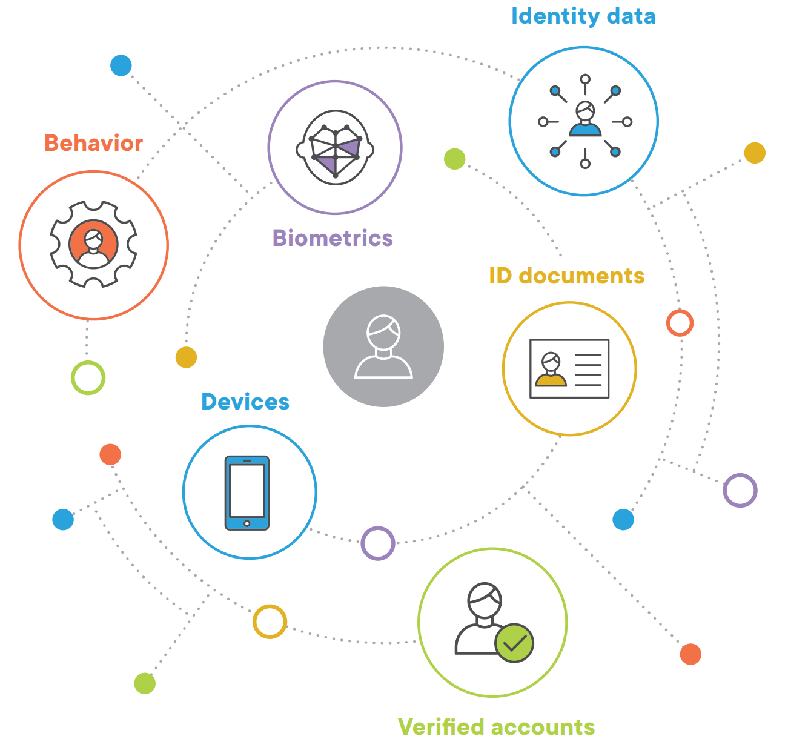
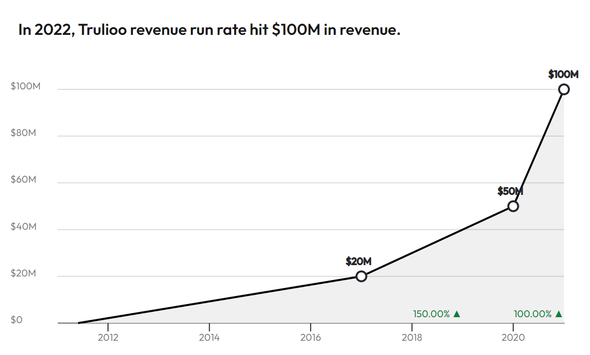

# Trulioo - Global Online Identity Verification Service

## **1. Overview and Origin**
Trulioo is a global identity and business verification company that provides secure access to reliable, independent, and trusted data sources worldwide to instantly verify consumers and business entities online. GlobalGateway, the Trulioo identity verification marketplace, helps organizations comply with Anti-Money Laundering (AML) and Customer Due Diligence (CDD) requirements by Automating Know your Customer (KYC) and Know Your Business (KYB) workflows. Trulioo supports global clients to instantly verify 5 billion people and 330 million business entities in over 195 countries - all through a single API integration. Named as a CNBC Disruptor 50 Company, the Trulioo mission is to solve global problems associated with verifying identities by powering fraud prevention and compliance system for customers worldwide in an effort to increase trust and safety online. Trulioo had built an identity marketplace of over 400 trusted data sources that have been rigorously vetted and deliver the highest standards of privacy and data protection.[1]

Trulioo, which was founded in 2011 by Stephen Ufford and Tanis Jorge, allows companies and organizations to run global identity checks. The company is headquartered in Vancouver, and has offices in Dublin, San Diego and Austin.[2]

- *Email ID: [info@trulioo.com](mailto:info@trulioo.com)*
- *Website: [www.trulioo.com](https://www.trulioo.com)*
- *Last Funding Round: $394M, Series D, Jun 07, 2021*
- *Total Raised: $469.74M*
- *Post-Money Valuation: $1.75B on Jun 07, 2021*
- *Accelerators: Plug and Play Tech Center*

---
### 1.1. Trulioo Idea
After starting multiple data-driven businesses together, Stephen Ufford and Tanis Jorge recognized the importance of individuals having online identities, particularly in developing countries where many don’t have a formal record of their existence. Stephen and Tanis launched Trulioo as an identity verification
service, and subsequently acquired Global Data Company, entering the anti-laundering compliance space.
In 2015, the company released its flagship product,GlobalGateway, which helps customers comply with cross-border Anti-Money Laundering (AML) and Know Your Client (KYC) rules. 

---
### 1.2. Fund Rising by Trulioo
Trulioo had 8 successful fund rising [3] that you can find details in below table:

| Funding Date  |  Funding Amount  | Funding Round  | Investors  |
|:-------:|:---:|:---:|:---:|
|Jun 07, 2021   | $394M            | Series D       | TCV, Blumberg Capital, Citi Ventures, American Express Ventures, Mouro Capital  |
|Sep 17, 2019   | $52.9M           | Series C       | Goldman Sachs, Citi Ventures, American Express Ventures, Mouro Capital  |
|Jul 31, 2018   | $8.3M            | Series B       | BDC, Blumberg Capital   |
|Dec 14, 2015   | $12.3M            | Series B       | BDC, Blumberg Capital   |
|Aug 26, 2014   | $1M              | Convertable Note       | UST  |
|Mar 11, 2014   | $6M              | Series A       | Tenfor Holding  |
|May 29, 2012   | $2M              | Seed Round       | Blumberg Capital  |
|Jan 01, 2011   | CA$300K              | Angle Round       | Stephen Ufford  |

---
## **2. Business Activities:**
Digital identity verification plays a crucial role in protecting business and their customers from risk. And forward-thinking businesses are looking for identity verification solutions that also support their global growth and help them adapt to changing regulations and technologies.
Unfortunately, technological progress also brings more threat from individuals who want to exploit these advances. In the hands of bad actors, the technology that makes our lives better also puts businesses and their customers at risk. New account fraud was up 13% in 2018 [4], money laundering is estimated at 2 to 5 present of global GDP annually [5] and cybercrime is expected to cost the world $6 trillion annually beginning in 2021 [6]. These dangers have places identity risk in the spotlight because they threaten two core human values: trust and privacy. As society combats the scourges of money laundering and identity theft, Anti-Money Laundering (AML), Know your Customer (KYC) and privacy regulation have become more complex, stringent, and numerous. 
This is the complex nature of business in the digital age. Change is constant, and processes for managing identity risk must be able to adopt to new conditions. To survive and scale, companies must efficiently assess the various types of risks associated with digital identities when deciding who to do business with. These regulations can be confusing, and the fine for non-compliance can be crippling. In 2019, 58 anti-money laundering penalties amounted to just over $8 billion in fines. In the U.S. alone, financial institutions have been changed $24 billion in fines in past 11 years. 

When you can verify a customer anywhere around the globe, everyone wins. People who are underbanked gain access to financial services. Overseas workers can send money home to their families. Individuals from all walks of life can trust each other to trade goods and services online.
And your business can scale. Expand into new countries and regions, adapting to the local verification landscape with ease. Expand into the future, handling changing regulations and scaling your Anti-Money Laundering (AML) and Know Your Customer (KYC) compliance processes.

---
### 2.1. Trulioo Solutions 
Trulioo offers 4 solutions [1] as below to cover identified risks:

*A. Identity Verification*
 - Compare identity data against independent data sources
 - Support Know Your Customer (KYC) processes
 - Grow your customer base

*B. ID Document Verification*
 - Run effective document checks
 - Deploy dynamic routing to increase pass rates
 - Authenticate users with selfies

*C. Business Verification*
 - Verify business details and owners
 - Obtain official company documents
 - Verify over 330 million businesses

*D. AML Watchlist* 
 - Cover sanction lists like OFAC, UN, DFAT, EU, HMT
 - FATF Compliance list for PEP
 - Real time global coverage in 190 countries 

---
### 2.2. Market size
The global identity verification market was valued at USD 7.66 billion in 2020. It is expected to reach USD 16.65 billion by 2026, registering a CAGR of 13.29% during the forecast period (2022-2031). Multiple businesses have been ramping up their identity verification processes to protect customers during the COVID-19 pandemic. According to Trulioo, a global identity verification provider, 72% of online marketplaces have increased their adoption of ID verification technology due to COVID-19. Also, more than half of financial services organizations have fueled the said adoption. This sudden speed in identity verification adoption is a clear reflection of the urgency to protect the vast numbers of consumers who have been forced to use digital services for the first time due to lockdown restrictions.[7]

Adoption of solutions through stringent regulations and the need for compliance are influencing market growth. The regulatory authorities have become stricter toward KYC (Know Your Customer) and AML (Anti-money Laundering) compliance among reporting entities.

With increasing online services and smartphone penetration, verifying identities digitally is becoming crucial for both businesses and governments. The regulatory authorities are increasingly becoming stringent toward KYC and AML compliance among businesses to control financial crime. FATF (Financial Action Task Force) increased the scope of reporting entities and recommended the member countries to oblige the legal professionals. Art dealers and virtual asset dealers to perform AML screening on their customers.

---
### 2.3. Trulioo value proposiion 
Trulioo services have spesific featuers that make it differ in market, in below we will review these features:

**A- Global coverage** : Verify over 5 billion people and 330 million businesses worldwide. GlobalGateway is the premier global marketplace for identity services and data sources. You won’t find another identity verification provider that connects you to so many trusted identity networks around the world [1]. Validate against 400+ reliable data sources in 195+ countries:

* Mobile networks
* Credit bureaus
* Banks
* Governments
* Utilities
* Consumer files
* Business registers
* Biometrics

**B-Holistic approch:**
GlobalGateway enables clients to take a layered and holistic approach to identity verification, increasing acceptance rates for legitimate customers and accuracy levels for fraud detection during onboarding. Rather than having to choose between IDV, ID document verification and KYB or manage multiple contracts and integrations, companies can combine verification services through one API to get additional risk and fraud protection.

Trulioo is continually adding new data sources and technology to expand identity verification coverage and capabilities. These additions support the ever-changing regulations, use cases and business requirements that stem from digital experiences introduced by emerging tech companies. New partnerships allow us to make leaps ahead in functionality and breadth of coverage as we leverage the development efforts and data management efforts of trusted third parties [1].

**C- Patente list:** Trulioo has following registerd patent that used in GlobalGateway solution [3]: 

*Identity validation system and associated methods (Filed 2014-04-14/ Granted 2017-03-28)*

* A computer system and associated methods for verifying user identities online. Identity claims made by a requestor of an online access and/or a trusted transaction may be verified by associating digital credentials to verified personal identification information (PII) retrieved from real world events. PII item(s) may be retrieved from third-party verified identity information sources. Verified personal attributes related to PII items may be identified and correlated with the requestor's digital credentials, and stored to a verified identity record. Additional digital credentials for the same requestor may be similarly identified, correlated, and stored to the verified identity record. A subsequent transaction request by a person claiming the requestor's identity may be compared with the verified identity record. An identity match indicator and/or a match confidence score may be created and used to determine the risk that the identity claim by the person requesting the transaction is false. 

*Commerce websites Marketing terminology Social networking services Identity management Integrated Services Digital Network
System, method, and computer program product for verifying the identity of social network users (Filed 2010-03-25 / Granted 2012-11-20)*

* An advanced identity verification system, method, and computer program product are provided that enable a user to create and individualize a repository of identifying data, and then incorporate that repository into processes that require reliable identification of an individual. Real-world acquaintances of the user can be queried to determine the accuracy of identifying data in the repository. As more and more acquaintances respond concerning a particular item of identifying data, a numeric accuracy index may be provided that permits an inquiring party to determine whether the identifying data may be trusted.

---
### 2.4. Trulioo Technologies
Trulioo started as a data-driven business and use Big Data and data analytics to improve services. Also, they add Machin Learning to accurate response and identify abnormal behaviors and fraud detection. By the COVID19 effect and demand for non-present service, they offered online onboarding service by AI-based image processing for document verification, user biometrics verification, OCR, and liveness control.

Some of the technologies that Trulioo used in GlobalGateway are listed below[8]:

- JavaScript 
- Python
- Node.js
- React Native
- Java
- C#
- Ruby
- Swift and xcframework 
- Hadoop 
- NGNIX
- Docker
 

---
## **3. Landscape:**
According to PWC Canada FinTech landscape[9], Trulioo identifed as RegTech company.

Regulatory technology. This term describes the field of companies that help financial firms deal with the burden of regulations. According to Deloitte, “RegTech helps firms to automate the more mundane compliance tasks and reduce operational risks associated with meeting compliance and reporting obligations. In the long term, RegTech will empower compliance functions to make informed risk choices based on data provided insight about the compliance risks it faces and how it mitigates and manages those risks.” 

Stringent regulations are required as compliance reduces the chances of criminal conspiracy, which results in reduced risk of money-related crimes such as terrorism financing, corruption, and money laundering. In addition, increasing number of financial frauds have resulted in adoption of regulations from different regulators, which include The Financial Industry Regulatory Authority (FINRA), China's Banking and Insurance Regulatory Commission (CBIRC), and Australian Transaction Reports and Analysis Centre (AUSTRAC).

However, non-compliance to regulations lead to heavy fines on the non-compliant parties. Increasingly stringent government compliances and regulations and instructions to financial institutions to adopt AML solutions such as Know Your Customer/ Customer Due Diligence (KYC/CDD) to ensure that customers are not involved in money-related crimes are expected to drive market revenue growth during the forecast period.

---
### 3.1. Trends and Innovation 
Innovation in identity verfication solutions goes beyond just controlling costs and acuracy. With the help of technologies such as AI, blockchain and API. we look at main ways that compliance teams can secure competitive advantage.

**A. Biometric Security**
Biometric Security 
Financial services have seen a surge in demand over the past few years. This calls for digital advances that empower KYC to better assess customers and take down identity fraud. In 2021, fintech firms are adopting biometric authentication technology like facial and fingerprint recognition as a more accurate and reliable means of meeting KYC standards.  [10]

**B. Artificial Intelligence(AI) and Machine Learning (ML)**
Banks and fintech businesses are moving towards AI-powered solutions to speed up their customer onboarding procedures. In this COVID-struck time, financial firms are banking on new and improved technology to maximize their sales. With the power of machine learning and AI, fintechs can monitor suspicious transactions, and effortlessly engage with new prospects at the same time through digital KYC. [10]
When assessing vast international third-party networks, it is necessary to connect all relevant data and build a comprehensive, 360-degree view of risk. Ways that machine learning and/or AI can be applied in this space include:

* Intelligent tagging of people, places, facts and events across millions of documents at speed to create enriched content that can be searched with ease and precision.
* Information deduplication to identify and cluster duplicate or similar content.
* Identification of entity to risk relationship mapping — creating a link between a specified entity and any potential risk.
* Event based deduplication to separate content into event clusters, allowing users to focus only on the combination of the entity and event they are interested in.

**C. Cloud-based API technology**
This technology has the power to deliver industry leading data and intelligence directly to in-house compliance workflow systems to help compliance professionals make informed decisions about risk. [11]

 Together with the digitalization, two of the important features expected from a financial service are pace and safety. To fortify their AML procedures, it is crucial for financial institutions to incorporate faster methods to detect suspicious activities in their monitoring systems. The FIs can manage the risks by embracing technology-driven tools which will assist in reducing false positives, monitoring suspicious activities and preventing or eliminating them. The increase in cross-border  payments is another driver of using API technology in transaction monitoring services. With the support of an API-powered solutions, institutions will possible to detect money laundering crimes in advance, as in the client screening process against global databases, PEP lists and watchlists.

**D. Blockchain**
Blockchain has several inherent characteristics that make it a theoretically advantageous technology to leverage in the KYC space. These include the immutability of records, enhanced privacy, a shared ledger (which improves access to accurate information across the industry) and greater transparency.

Conceptually, blockchain provides the perfect platform to deliver an automated, secure, trustworthy KYC solution that improves the client experience, streamlines operational processes and enhances regulatory compliance. [11]

---
### 3.2. Trulioo compatitues 

| Company Name | Fund | HQ location  | Revenue | Employees |
|---|:-------:|:---:|:---:|:---:|
|Veriff  | $192.32M | Estonia  | $100 | 400 |
|Socure  | $648.25M  | New York  | $100M | 400 |
|Persona  | $217.5M	  | California | $6.9M | 20 |
|Jumio  | $201.71M  | California  | $100M  | 1500 |
|Onfido  | $209.53M | United Kingdom  | $100M | 400 |

---
## **4. Results**

## 4.1. Revenue 
Trulioo's estimated annual revenue is currently $55.6M per year[12]. Other refrences shows that in 2022, Trulioo revenue run rate hit $100M [13].

Trulioo has 337 Employees.[12]

Trulioo has around 450 Customers, with avarage annual price $220K [13].

## 4.2. Result evaluation 
Suggested core metrices to evaluate active companies in identity verification listed as:
- Functional Features
    - Identity Verification
    - Behavioral Analytics
    - Business verification and due diligence 
    - Compliance Reporting
    - PEP Screening
    - Transaction Monitoring
    - Watch List
    - Biometic Security
    - PKI Serivces
    - Fraud Detection 
    - Age Detection 
- Non-Functional Features
    - Supported Platforms ( Windows, Linux, Mac, iOS, Android, SaaS) 
    - Accuracy 
    - Global coverage
    - Trusted Data Source
    - Used Technologies 
- Ease of setup and use
    - API
    - SDK
    - Documentation 
    - Training

Unfortunately, couldn’t find vendors information about all above metrics so based on available information makes digested metrics list [13] [14] [15] [16].

| Company Name | Platforms | Global Coverage  | Online Onboarding | Watch List | KYB | API/SDK | Biometric | Fraud Detection |
|---|:-------:|:---:|:---:|:---:|:---:|:---:|:---:|:---:|
|Trulioo  | SaaS | 190+ | Yes  | Yes | Yes | Yes |Yes |Yes |
|Veriff  | SaaS/iOS/Android |190  | Yes | No | No | Yes |Yes |No |
|Socure  | SaaS  | 190  | Yes | No | No | Yes |No |No |
|Persona  | SaaS | 200 | Yes | Yes | Yes | Yes |No |Yes |
|Jumio  | SaaS/iOS/Android | 200  | Yes  | Yes | Yes | Yes |No |Yes |
|Onfido  | SaaS | 195  | Yes | No | No | Yes |Yes |No |

---
## **5. Recommendations**
Trulioo has enough potential to expand sevices in difrrent areas. some of services and solution that I think that Trulioo can deliver, suggested in below:

### 5.1. New services and Solutions:

**A. Age Detection**
If you operate within Healthcare or Gaming, or sell age-restricted products, regulation has never been tighter. Your online age verification processes must accurately and reliably restrict access for minors. Regulators can and will hold your business accountable. And they’re aligned on one essential point—to simply ask “are you over 18?” or “are you over 21?” may no longer be enough. It doesn’t qualify as age verification, nor does it prove due diligence. Get age verification wrong and your company could face closure.

**B. Certificate Authority (CA)**
In cryptography, a certificate authority or certification authority (CA) is an entity that stores, signs, and issues digital certificates. A digital certificate certifies the ownership of a public key by the named subject of the certificate. This allows others (relying parties) to rely upon signatures or on assertions made about the private key that corresponds to the certified public key. A CA acts as a trusted third party—trusted both by the subject (owner) of the certificate and by the party relying upon the certificate. The format of these certificates is specified by the X.509 standard.
A CA issues digital certificates that contain a public key and the identity of the owner. The matching private key is not made available publicly, but kept secret by the end user who generated the key pair. The certificate is also a confirmation or validation by the CA that the public key contained in the certificate belongs to the person, organization, server or other entity noted in the certificate. A CA's obligation in such schemes is to verify an applicant's credentials, so that users and relying parties can trust the information in the issued certificate. CAs use a variety of standards and tests to do so. In essence, the certificate authority is responsible for saying "yes, this person is who they say they are, and we, the CA, certify that". If the user trusts the CA and can verify the CA's signature, then they can also assume that a certain public key does indeed belong to whoever is identified in the certificate.
Trulioo has potential to launch B2C service and after identity verification, Issue a digital certificate for person or business. by this way customers can add their digital signture to any other documents or message in any system.   

**C. Portable KYC**
Current Trulioo's KYC solution working as online enquirer-based model and result of Identity verification is not trustable to share it to any other parties. Any new party should verify user’s KYC again with Trulioo. Trulioo can offer a solution that users make a KYC portable package that referred to Trulioo online identity verification with specific validation time. 

---
### 5.2. New soltion Technlogies:

**A. Age Detection by AI**
Trulioo’s Document Verification extracts the date of birth (OCR) from a presented ID. Crucially, it allows you to verify that the person creating an account, or making an online purchase, is over a specified age. You can make fast, informed decisions based on a reliable, binary recommendation, while satisfying due diligence.
Also adding biometrics feature powered by AI gives more security. By analyzing a live selfie or video with a learned AI system, is possible to find out user age with acceptable accuracy.

**B. CA and PKI**
A public key infrastructure (PKI) is a set of roles, policies, hardware, software and procedures needed to create, manage, distribute, use, store and revoke digital certificates and manage public-key encryption. The purpose of a PKI is to facilitate the secure electronic transfer of information for a range of network activities such as e-commerce, internet banking and confidential email. It is required for activities where simple passwords are an inadequate authentication method and more rigorous proof is required to confirm the identity of the parties involved in the communication and to validate the information being transferred.

In cryptography, a PKI is an arrangement that binds public keys with respective identities of entities (like people and organizations). The binding is established through a process of registration and issuance of certificates at and by a certificate authority (CA). Depending on the assurance level of the binding, this may be carried out by an automated process or under human supervision. 

PKI provides "trust services" - in plain terms trusting the actions or outputs of entities, be they people or computers. Trust service objectives respect one or more of the following capabilities: Confidentiality, Integrity and Authenticity (CIA).

- Confidentiality: Assurance that no entity can maliciously or unwittingly view a payload in clear text. Data is encrypted to make it secret, such that even if it was read, it appears as gibberish. Perhaps the most common use of PKI for confidentiality purposes is in the context of Transport Layer Security (TLS). TLS is a capability underpinning the security of data in transit, i.e. during transmission. A classic example of TLS for confidentiality is when using an internet browser to log on to a service hosted on an internet based web site by entering a password.

- Integrity: Assurance that if an entity changed (tampered) with transmitted data in the slightest way, it would be obvious it happened as its integrity would have been compromised. Often it is not of utmost importance to prevent the integrity being compromised (tamper proof), however, it is of utmost importance that if integrity is compromised there is clear evidence of it having done so (tamper evident).

- Authenticity: Assurance that you have certainty of what you are connecting to, or evidencing your legitimacy when connecting to a protected service. The former is termed server-side authentication - typically used when authenticating to a web server using a password. The latter is termed client-side authentication - sometimes used when authenticating using a smart card (hosting a digital certificate and private key).

**C Portable KYC by DLT**
DLT and Tokenization are suitable technologies to make a portable KYC for solutions or service providers. Trulioo can make a portable KYC package as a Token on public TLD and the user as the token owner can transfer KYC information to other parties in a secure way with trustable references. 
A distributed ledger (also called a shared ledger or distributed ledger technology or DLT) is a consensus of replicated, shared, and synchronized digital data geographically spread across multiple sites, countries, or institutions. Unlike with a centralized database, there is no central administrator.

A peer-to-peer network is required as well as consensus algorithms to ensure replication across nodes is undertaken. One form of distributed ledger design is the blockchain system, which can be either public or private.

---
## **6. Refrences and Resurces** 
[1] [www.trulioo.com](https://www.trulioo.com/)

[2] [www.wikipedia.org](https://en.wikipedia.org/wiki/Trulioo)

[3] [www.crunchbase.com](https://www.crunchbase.com/organization/trulioo/company_financials)

[4] Rob Douglas, Consumer Affairs, “2020 Identity Theft Statistic, March 27, 2020

[5] United Nations, “Money-Laundering and Globalization,” March 2020

[6] Steven Morgan, Cybersecurity Ventures, “2019 Official Annual Cybercrime Report,” March 2020

[7] [Digital Journal](https://www.digitaljournal.com/pr/identity-verification-market-size-share-by-top-10-players-covered-major-segments-regions-and-key-drivers-outlook-2022-2031) - Identity Verification Market Size & Share by Top 10 Players

Read more: https://www.digitaljournal.com/pr/identity-verification-market-size-share-by-top-10-players-covered-major-segments-regions-and-key-drivers-outlook-2022-2031#ixzz7UkzMysem

[8] https://developer.trulioo.com/docs

[9] [Mapping Canada’s maturing fintech market](https://www.pwc.com/ca/en/industries/technology/mapping-canadas-maturing-fintech-market.html) 

[10] https://shuftipro.com/blog/fintech-2021-kycaml-bringing-new-innovation-to-the-table/

[11] https://growjo.com/company/Trulioo

[12] https://getlatka.com/companies/trulioo

[13] https://www.owler.com/company/trulioo/competitors

[13] https://sourceforge.net/software/compare/Ondato-vs-Socure-vs-Trulioo-vs-Veriff/#claim_globalgateway.s

[14] https://www.saashub.com/compare-trulioo-vs-veriff?ref=sidebar
[15] https://developer.trulioo.com/docs

[16]https://craft.co/trulioo/competitors?competitors=trulioo%2Cveriff%2Cjumio%2Confido%2Cverafin%2Csocure%2Cpersona-435
